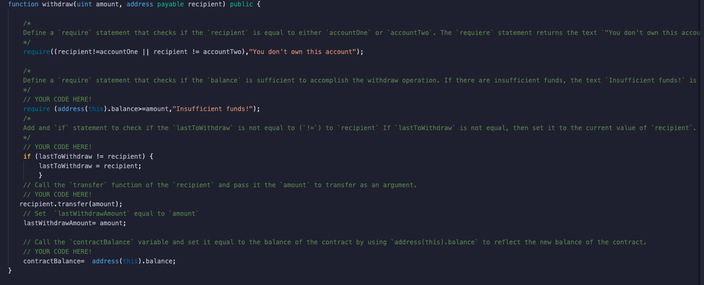
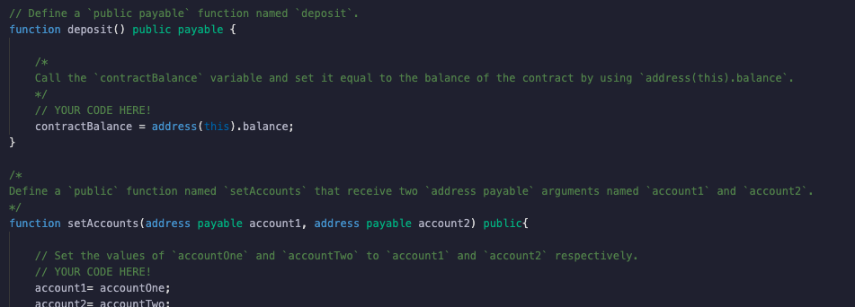
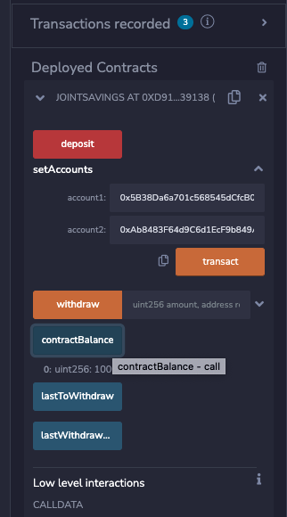
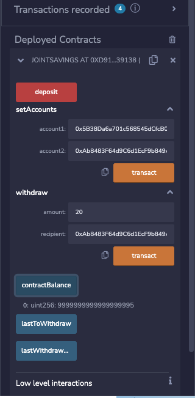
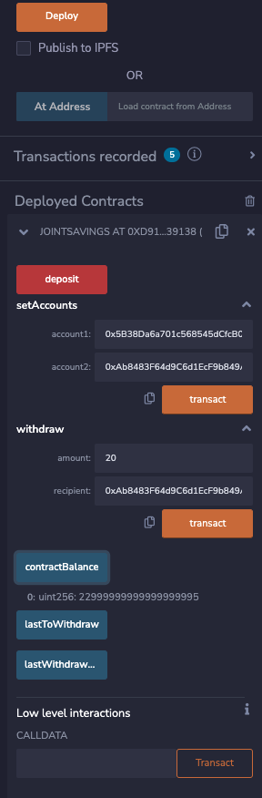

# Blockchain-based-Joint-Account

Blockchains have various usage acorss different industries, yet, finance has become one of the most accepted industries to embrace the techonlogy. While blockchain technology and platforms such as Ethereum network are in some of the most beloved blockchain networks, its application has been far more useful and versatile being merely a cryptofurrency platform.

In this application, we developed a platform based on ethereum technology that allows the user to automate and operate a financial institution's joint savings accounts. The program allows the user to setup an joint account baed of two user addresses. The application uses ether and its sub units to deposit and withdraw funds. The application was coded using solidty and it secures the term and conditions using smart contract.

# Technology

Remix IDE was used to write, compile and deploy the porgram, while the base of the program is the programing language Solidity. The program follows the protocals of solidty, and works on a ethereum compatible blockchain. 

## Application

The program uses a smart contract to ensure the nature of its transactions, and executions.

* First it declares different variables it would be using in the process. The variables include address payables, uint(unsigned integer) variables, while some of the variables are public.
\

* We set functions where we embed contracts that would ensure the terms and conditions.

* Finally we put a fall back function.

The program can be then complied and deployed.

The program allows user to deposit and withdraw funds to an joint account using ethererum based blockchaion techonology/ address. As we caan see in the contractBalance, the amount of balance in the joint account continues to vary with each deposit or withdrawl. 

---
Babin Shrestha

